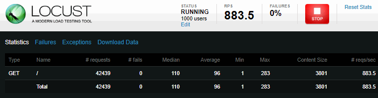

Docker image for [locust.io](http://locust.io)

# standalone

    docker run -d -p 8089:8089 --name locust -e LOCUST_MODE=standalone -e TARGET_URL=http://127.0.0.1 centminmod/docker-ubuntu-locust

# distributed

**master**

    docker run -d -p 8089:8089 --name locust -e LOCUST_MODE=master -e TARGET_URL=http://127.0.0.1 centminmod/docker-ubuntu-locust

**slave**

Where `<master-server-ip` is IP address for locust.io master

    docker run -d -p 8089:8089 --name locust -e LOCUST_MODE=slave -e MASTER_HOST=http://<master-server-ip> -e TARGET_URL=http://127.0.0.1 centminmod/docker-ubuntu-locust

# inspecting logs

    docker logs locust -f

example run for named `locust` image:

    docker run -d -p 8089:8089 --name locust -e LOCUST_MODE=standalone -e TARGET_URL=https://domain.com centminmod/docker-ubuntu-locust

example run log inspection for docker image named `locust`

    docker logs locust -f
    => Starting locust
    /usr/local/bin/locust -f /locust/scripts/locust0.py --host=https://domain.com
    [2017-07-06 03:43:59,718] 9ba173c41ae7/INFO/locust.main: Starting web monitor at *:8089
    [2017-07-06 03:43:59,718] 9ba173c41ae7/INFO/locust.main: Starting Locust 0.7.5
    [2017-07-06 03:45:25,073] 9ba173c41ae7/INFO/locust.runners: Hatching and swarming 1000 clients at the rate 100 clients/s...
    [2017-07-06 03:45:42,760] 9ba173c41ae7/INFO/locust.runners: All locusts hatched: MyLocust: 1000
    [2017-07-06 03:45:42,760] 9ba173c41ae7/INFO/locust.runners: Resetting stats

