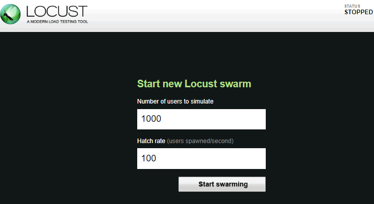

Docker image for [locust.io](http://locust.io)

# standalone

where `TARGET_URL` is the site domain name you want to test i.e. `TARGET_URL=http://domain.com`

    docker run -d -p 8089:8089 --name locust -e LOCUST_MODE=standalone -e TARGET_URL=http://127.0.0.1 centminmod/docker-ubuntu-locust

use native host network to lower network overhead

    docker run -d -p 8089:8089 --net=host --name locust -e LOCUST_MODE=standalone -e TARGET_URL=http://127.0.0.1 centminmod/docker-ubuntu-locust

# distributed

**master**

where `TARGET_URL` is the site domain name you want to test i.e. `TARGET_URL=http://domain.com`

    docker run -d -p 8089:8089 --name locustmaster -e LOCUST_MODE=master -e TARGET_URL=http://127.0.0.1 centminmod/docker-ubuntu-locust

use native host network to lower network overhead

    docker run -d -p 8089:8089 --net=host --name locustmaster -e LOCUST_MODE=master -e TARGET_URL=http://127.0.0.1 centminmod/docker-ubuntu-locust

**slave**

Where `<master-server-ip` is IP address for locust.io master and `TARGET_URL` is the site domain name you want to test i.e. `TARGET_URL=http://domain.com` and first slave named `--name locustslave1`. For second slave name `--name locustslave2`, third slave name `--name locustslave3` etc.

    docker run -d -p 8089:8089 --name locustslave1 -e LOCUST_MODE=slave -e MASTER_HOST=http://<master-server-ip> -e TARGET_URL=http://127.0.0.1 centminmod/docker-ubuntu-locust

use native host network to lower network overhead

    docker run -d -p 8089:8089 --net=host --name locustslave1 -e LOCUST_MODE=slave -e MASTER_HOST=http://<master-server-ip> -e TARGET_URL=http://127.0.0.1 centminmod/docker-ubuntu-locust

# inspecting logs

    docker logs locust -f

example run for named `locust` image:

    docker run -d -p 8089:8089 --name locust -e LOCUST_MODE=standalone -e TARGET_URL=https://domain.com centminmod/docker-ubuntu-locust

example run log inspection for docker image named `locust`

    docker logs locust -f
    => Starting locust
    /usr/local/bin/locust -f /locust/scripts/locust0.py --host=https://domain.com
    [2017-07-06 03:43:59,718] 9ba173c41ae7/INFO/locust.main: Starting web monitor at *:8089
    [2017-07-06 03:43:59,718] 9ba173c41ae7/INFO/locust.main: Starting Locust 0.7.5
    [2017-07-06 03:45:25,073] 9ba173c41ae7/INFO/locust.runners: Hatching and swarming 1000 clients at the rate 100 clients/s...
    [2017-07-06 03:45:42,760] 9ba173c41ae7/INFO/locust.runners: All locusts hatched: MyLocust: 1000
    [2017-07-06 03:45:42,760] 9ba173c41ae7/INFO/locust.runners: Resetting stats

# tips

setup a SSH alias commands

to remove docker image `locust` standalone

    alias rmlocust='docker stop locust; docker rm locust; docker rmi centminmod/docker-ubuntu-locust;'

to remove docker image `locustmaster` master

    alias rmlocustmaster='docker stop locustmaster; docker rm locustmaster; docker rmi centminmod/docker-ubuntu-locust;'

to remove docker image `locustslave1` slave `#1`

    alias rmlocustmaster='docker stop locustslave1; docker rm locustslave1; docker rmi centminmod/docker-ubuntu-locust;'